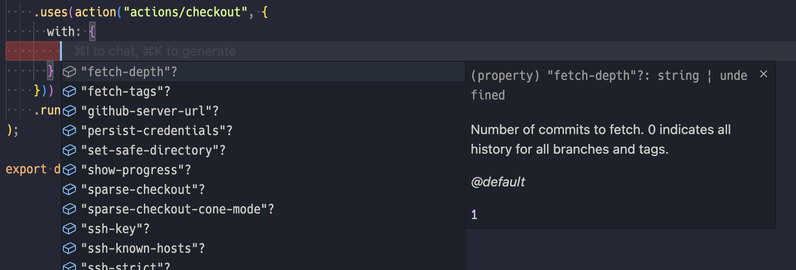

# GitHub Actions with TypeScript

[](https://www.npmjs.com/package/ghats)
[](https://codecov.io/gh/koki-develop/ghats)
[](./LICENSE)

```ts
// .github/workflows/hello.ts
import { Workflow, Job } from "ghats";

const workflow = new Workflow("Hello", {
  on: "push",
});

workflow.addJob(
  new Job("hello", {
    runsOn: "ubuntu-latest",
  })
    .uses("actions/checkout@v4")
    .run("echo 'Hello, world!'"),
);

export default workflow;
```

## Installation

```console
$ npm install -D ghats
```

## Getting Started

Create workflow in `.github/workflows/*.ts` using the `ghats`.

```ts
// .github/workflows/hello.ts
import { Workflow, Job } from "ghats";

const workflow = new Workflow("Hello", {
  on: "push",
});

workflow.addJob(
  new Job("hello", {
    runsOn: "ubuntu-latest",
  })
    .uses("actions/checkout@v4")
    .run("echo 'Hello, world!'"),
);

export default workflow; // NOTE: don't forget this line
```

Run `ghats build` to build GitHub Actions Workflow files as `.github/workflows/*.yml`.

```console
$ npx ghats build
```

That's all you need to know for basic usage!

### Type Support for Remote Actions

Run the `ghats install` command with the target action specified.

```sh
$ npx ghats install actions/checkout
```

Then you can import the `action` function from `ghats`.  
The `action` function provides type support for installed actions and their inputs.

```ts
// .github/workflows/hello.ts
import { Workflow, Job, action } from "ghats";

// ...

workflow.addJob(
  new Job("hello", { /* ... */ })
    .uses(
      // ↓↓ Like this! ↓↓
      action("actions/checkout", {
        with: { "persist-credentials": "false" },
      }),
    )
    // ...
);

// ...
```



Installed actions are recorded in `.github/workflows/action.json` and `.github/workflows/actions-lock.json`.

### Files Ignored During Build

By default, `ghats build` builds all `.github/workflows/*.ts` files, but ignores files that start with `_` (e.g. `.github/workflows/_helpers.ts`).  
It's recommended to write common utilities and non-workflow code in these ignored files.

### Configuring GitHub API Token

The `ghats install` command uses the GitHub API internally.  
If you're using remote actions from private repositories or want to pass a GitHub API token to avoid rate limits, set the `GITHUB_TOKEN` environment variable.

```console
$ GITHUB_TOKEN=<YOUR_GITHUB_TOKEN> npx ghats install
```

## License

[MIT](./LICENSE)
